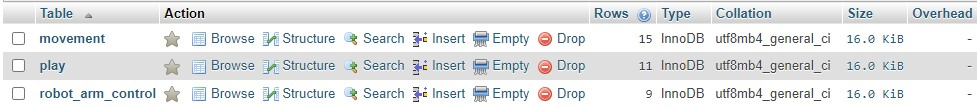
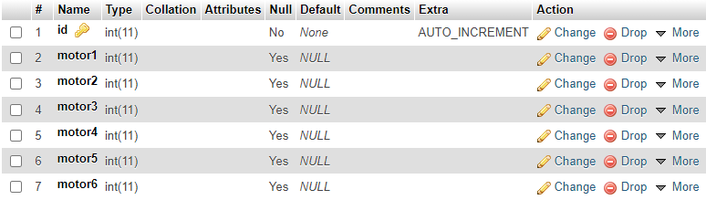
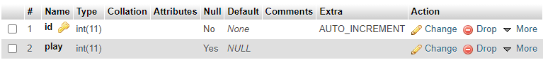

<h1> Task 2 - Robot Arm Controller Complete Interface with Arm and Base panels </h1>

 This task involves 6 subtasks. The main idea is to create an interface to control the arm and the base. The languages used are HTML, CSS, JavaScript, PHP and SQL.  
<b> Watch this <a href="https://youtu.be/6AHKEd37_Fw"> video </a> for a preview. </b> 
  <b>لترى كيف يعمل الموقع </a> شاهد <a href="https://youtu.be/6AHKEd37_Fw"> الفيديو </b>

<h2> Subtask 1 - Design an interface to control the robot base </h2>

 The first part of the interface contains 6 range sliders, each one represents the servo motor that rotates from 0 to 180 degrees. The slider values are shown on the right of the slider. The second part contains 5 buttons to move the base: forward, backward, stop, left and right. The base will move according to the required movement and when you click any button, the website will redirect you to php page which will show the value of the button. 
  The related pages for this task are <b> control.html, the css folder and the js folder. </b> 

<h2> Subtask 2 - Build a database to control the robot arm </h2>

 The database is called robot_arm and it has 3 tables: 

   

 Table 1 - robot_arm_controller with 7 columns, each one representing the respective motor and an ID column.
   

 Table 2 - play with 2 columns, one for the id and the second is related to the on button.
    

 Table 3 - movements with 6 columns, one for the id and the other 5 represent the movements.
    

 The related page for this task is <b> robot_arm.sql </b> 

<h2> Subtask 3 - Connect the interface with the database</h2>

 When the user chooses values for the motors and clicks (save) , the values will be sent to the robot_arm table. The (on) button switches on the robot arm but sending 1 to the play column in the play table. When the user controls the base, the value of the button will be saved in the respective column in the movements table. For example, if the user clicks on forward, then "forward" will be saved in the forward column. The related page for this task is <b> conrol.php </b>

<h2> Subtask 4 - Write PHP pages to connect the database with the hardware</h2>
<ul>
  <li> This PHP page <b> showMotorValue.php </b> selects the most recent value from the robot_arm_controller table and displays them on the screen. </li>
  <li> This PHP page <b> showPlay.php </b> will show the value 1 which means that the arm is switched on. </li>
  <li> This PHP page <b> showMoves.php </b> will show the most recent movement value. </li>
</ul>

<h2> Subtask 5 - Combine the arm and the base controls</h2>

 Already combined as <b> control.html </b> shows. 

 
<h2> Subtask 6 - Mobile Web View</h2>

 The webpage is compatible with mobile web view as <b> control.html </b> shows. Follow these steps to check: 

<ul> 
  <li> Write click on the page. </li>
  <li> Click on inspect </li>
  <li> Click on the following keys combination: Ctrl + Shift + m. </li>
  <li> On the top bar, you can change the phone type or screen size to test. </li>
</ul>
  

